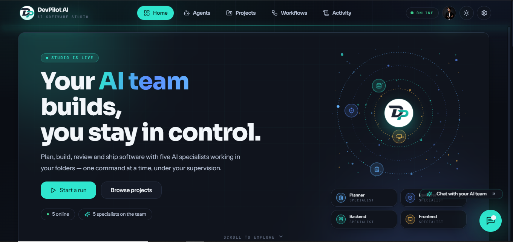
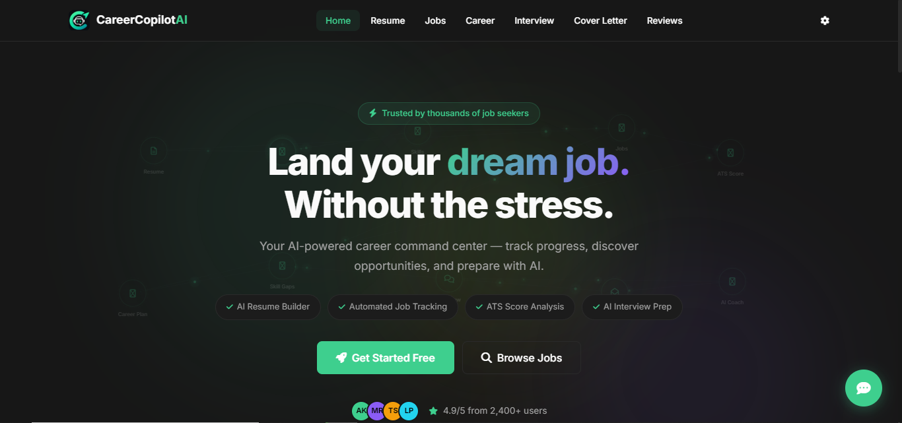

<div align="center">


<br/>

<a href="https://github.com/Dev-with-Mouzan"></a>
&nbsp;
<a href="https://www.linkedin.com/in/mouzan-raza-979230385"></a>
&nbsp;
<a href="https://my-portfolio-jz1h.vercel.app"></a>
&nbsp;


<br/><br/>

`agent orchestration` · `RAG pipelines` · `structured outputs` · `evals & observability` · `AI backends`

</div>

## About Me

```python
class MouzanRaza:
    role       = "GenAI Engineer"
    domains    = ["Agentic AI", "LLM Applications", "RAG"]
    current    = "Production-grade agentic systems, LLM evaluation, AI infrastructure"
    stack      = ["LangGraph", "LangChain", "FastAPI", "Docker", "AWS"]
    principles = [
        "validate model output — never trust raw responses",
        "keep deterministic logic outside the LLM",
        "retries and failure handling by default",
        "measure latency, tokens, cost, task success",
    ]
    motto      = "More than demos — validated, observable, deployed."

    def build(self) -> str:
        return "multi-agent workflows with structured state, memory, observability"

    def reach_me(self) -> str:
        return "github.com/Dev-with-Mouzan"
```

---

## 🚀 Featured Projects

<div align="center">

<table>
  <tr>
    <td width="33%" valign="top" align="center">
      <a href="https://github.com/Dev-with-Mouzan/DevPilot_Ai">
        
      </a>
      <br/>
      <a href="https://github.com/Dev-with-Mouzan/DevPilot_Ai"><b>🤖 DevPilot AI</b></a>
      <br/>
      <sub>Multi-agent software engineering platform<br/>Specialized agents plan, build, review, and deploy real projects.</sub>
    </td>
    <td width="33%" valign="top" align="center">
      <a href="https://github.com/Dev-with-Mouzan/CareerCopilot_AI">
        
      </a>
      <br/>
      <a href="https://github.com/Dev-with-Mouzan/CareerCopilot_AI"><b>💼 CareerCopilot AI</b></a>
      <br/>
      <sub>Career platform<br/>Resume parsing, job matching, ATS analysis, interview preparation.</sub>
    </td>
    <td width="33%" valign="top" align="center">
      <a href="https://github.com/Dev-with-Mouzan/FounderLens_AI">
        
      </a>
      <br/>
      <a href="https://github.com/Dev-with-Mouzan/FounderLens_AI"><b>🔭 FounderLens AI</b></a>
      <br/>
      <sub>Startup validation platform<br/>Parallel agents, quality gates, retry logic, advisor verdict.</sub>
    </td>
  </tr>
</table>

</div>

---

## Tech Stack

<div align="center">

<b>backend · infra</b>


<br/>

<b>frontend</b>


<br/><br/>


<br/>


</div>

---

## GitHub Analytics

<div align="center">


<br/><br/>


<br/><br/>


<br/><br/>

<b>A year of shipping — public + private work</b>
<br/><br/>


</div>

---

<div align="center">

<b>more than demos</b> — validated, observable, deployed.

</div>


